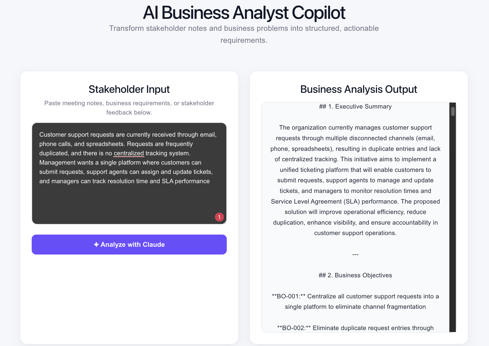

# AI Business Analyst Copilot

An AI-powered Business Analysis application that transforms unstructured stakeholder notes and business problems into structured, actionable requirements using Anthropic Claude.
## Application Demo

## Project Overview

Business Analysts often receive requirements through meetings, emails, stakeholder discussions, and fragmented notes. Converting this information into structured business requirements manually can be time-consuming.

AI Business Analyst Copilot uses Generative AI to analyze stakeholder input and automatically generate structured Business Analysis artifacts.

## Business Problem

Unstructured stakeholder information can lead to:

- Missing or unclear requirements
- Duplicate requirements
- Inconsistent documentation
- Longer requirement-analysis cycles
- Communication gaps between business and technical teams

## Solution

The application allows a Business Analyst to enter stakeholder notes or business requirements and uses Claude AI to convert them into structured analysis.

The generated output can include:

- Business Requirements
- User Stories
- Acceptance Criteria
- Risks and Gaps
- Stakeholder Questions

## How It Works

Stakeholder Input  
↓  
React User Interface  
↓  
Node.js / Express Backend  
↓  
Anthropic Claude API  
↓  
AI Requirement Analysis  
↓  
Structured BA Output

## Key Features

- Analyze unstructured stakeholder notes
- Identify business objectives and requirements
- Generate user stories
- Generate acceptance criteria
- Identify risks and requirement gaps
- Generate clarification questions
- Present structured analysis through a simple web interface

## Technology Stack

**Frontend**
- React
- Vite
- JavaScript
- CSS

**Backend**
- Node.js
- Express.js

**AI Integration**
- Anthropic Claude API

**Development & Version Control**
- VS Code
- Git
- GitHub

## Example Use Case

### Stakeholder Input

Customer support requests are received through email, phone calls, and spreadsheets. Requests are frequently duplicated and there is no centralized tracking system. Management wants a single platform where customers can submit requests, support agents can manage tickets, and managers can monitor resolution time and SLA performance.

### AI Business Analysis Output

The AI analyzes the stakeholder information and generates structured artifacts such as:

- Business objectives
- Functional requirements
- User stories
- Acceptance criteria
- Risks and gaps
- Stakeholder clarification questions

## Business Value

This solution demonstrates how Generative AI can support Business Analysts by accelerating requirement analysis, improving documentation consistency, identifying missing information, and helping convert stakeholder conversations into actionable requirements.

## Security

The Anthropic API key is stored in a local environment variable and is excluded from source control. API credentials are not committed to this repository.

## Future Enhancements

- Export requirements to PDF/Word
- Jira user-story integration
- Requirements traceability matrix
- Requirement prioritization
- AI-assisted change-impact analysis
- Upload meeting transcripts for automatic requirement extraction

## Author

**Vineela Nimmala**

Business Analyst | Data Analyst | AI Business Analysis